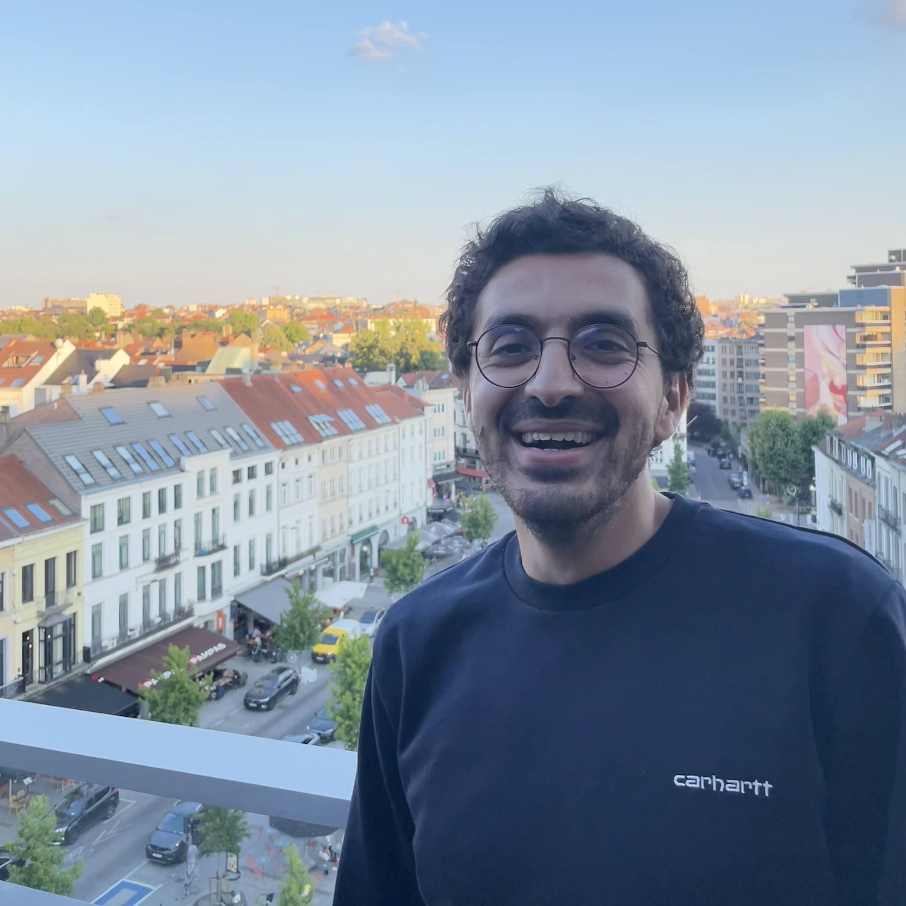

## About Me

Hi! I am an engineering student in Computer Science at [Ponts Paristech](http://www.enpc.fr/) and currently enrolled at a Master program([MVA](http://www.math.ens-cachan.fr/version-francaise/formations/master-mva/contenus-/master-mva-cours-2016-2017-161721.kjsp?RH=1242415112528)) in **Computer Vision and Machine Learning** at ENS Paris Saclay.

## Research Interest

I am broadly interested in Computer Vision, Machine Learning, Signal/Image Processing, Mapping systems and Statistics.

<!-- ## Publications

<!-- 1. F.Bar, J.Doe: Effects of having a placeholder of a name
2. S.Holmes, J.Watson: Consequences of living with a sociopath in London -->

## Experience

<!-- This is a [link](http://google.com). Something *italics* and something **bold**. -->

Here are some relevant experiences.

Year | Position | Topic
-----|-------|--------
2016 | Software Engineer @ [MapJam](https://mapjam.com) | Building GIS Stack and complex mapping applications
2015 | Software Engineer intern @ [Vehicle Data Science](https://www.crunchbase.com/organization/vehicle-data-science#/entity) | Data visualization with D3.js and Leaflet.js
2014 | Research intern @ [Cermics](http://cermics.enpc.fr/) | Study of financial Mathematics models

<!-- ---

Here is a blockquote

> To a great mind, nothing is little -->

## References

* Available upon request

I got all inspiration from a jekyll based resume template. You can find the full source code on [GitHub](https://github.com/bk2dcradle/researcher) and my version [GitHub](https://github.com/Rachine/Rachine.github.io)
