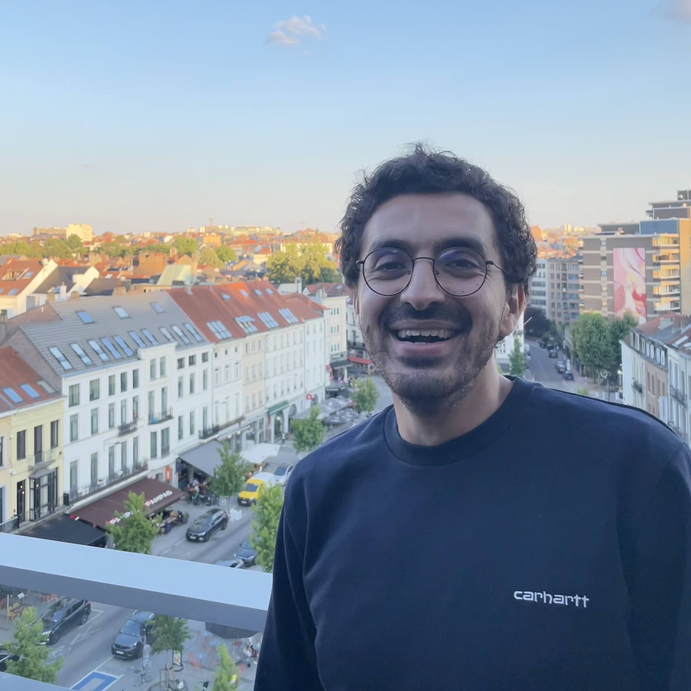

## About Me

Hi! I graduated in Applied Mathematics and Computer Science from [Ponts Paristech](http://www.enpc.fr/) and obtained with Honors the Master program([MVA](http://www.math.ens-cachan.fr/version-francaise/formations/master-mva/contenus-/master-mva-cours-2016-2017-161721.kjsp?RH=1242415112528)) in **Computer Vision and Machine Learning** at ENS Paris Saclay. I am now between the LSCP and NPI at ENS Paris under the supervision of [Pr. Emmanuel Dupoux](http://www.lscp.net/persons/dupoux/index.html) and [Pr. Anne-Catherine Bachoud-Lévi](http://www.imrb.inserm.fr/equipes/ac-bachoud-levi/).

## Research

Broadly, I'm interested in Speech and Language, Machine Learning, and Neuropsychology -- and trying to make links between all three.  My  PhD  project focuses  on the  automatic  assessment  of  cognitive,  linguistic,  and  emotional  disorders, which  affects  the  Speech Production of Huntington Disease patients.

<!-- On a long-term view, I -->
<!-- Broadly speaking, my research has two overarching goals: First, I view human cognition as a complex computational process, and seek a deeper understanding of the computational mechanisms underlying the human ability to learn and organize information. Second, I draw on these insights to develop methods to improve current artificial intelligence systems. -->

<!-- ## Publications

<!-- 1. F.Bar, J.Doe: Effects of having a placeholder of a name
2. S.Holmes, J.Watson: Consequences of living with a sociopath in London -->

<!-- ## Experience

Here are some experiences.

Year | Position | Topic
-----|-------|--------
2018 | Research assistant @ [SPOClab/ Vector Institute, University of Toronto](http://vectorinstitute.ai/) | Health assessment through speech technologies
2018 | Research assistant @ [LSCP & NPI/ ENS](https://npi.dec.ens.fr/) | Health assessment through speech technologies
2017 | Research intern @ [LSCP / ENS](http://www.lscp.net/index.php) | Machine learning meets language and cognitive development : How do babies learn their first language?
2016 | Software Engineer @ [MapJam](https://mapjam.com) | Building GIS Stack and complex mapping applications
2015 | Software Engineer intern @ [Vehicle Data Science](https://www.crunchbase.com/organization/vehicle-data-science#/entity) | Data visualization with D3.js and Leaflet.js
2014 | Research intern @ [Cermics](http://cermics.enpc.fr/) | Study of financial Mathematics models

<!-- ---

Here is a blockquote

<!-- > To a great mind, nothing is little -->

<!-- ## References

* Available upon request -->

I got all inspiration from a jekyll based resume template. You can find the full source code on [GitHub](https://github.com/bk2dcradle/researcher) and my version [GitHub](https://github.com/Rachine/Rachine.github.io)
