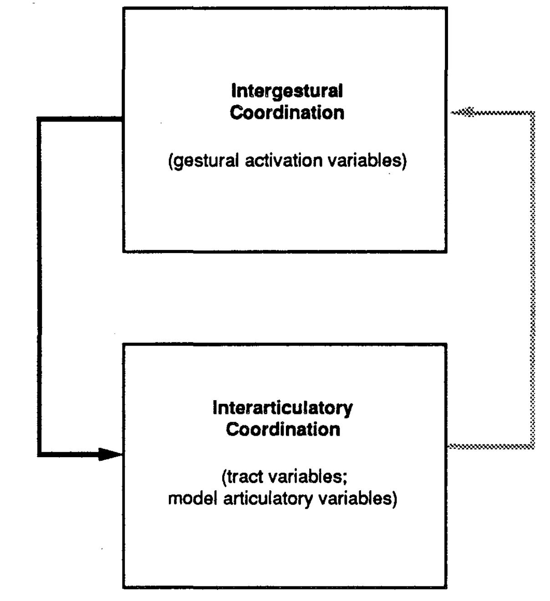

Issues to be addressed by speech production models
==================================================

-   Serial-Order Issue

-   Degrees of Freedom

-   Context-sensitivity Problem

The **Serial-Order** refer to the fact that speech is a sequence of
linguistic elements: e.g. the /k/ /ae/ /t/ are used in the words cat,
tack and act. The order determines how the word is perceived. The
underlying theory for speech, is speech is organised in smaller sized
units, phonemes or syllables. (Is speech organisation phonemic or
syllable sized?)

The **degrees of freedom** (**df**) refer to the physical configuration
and changes that produce a specific sound through different muscles
contractions, locations and timings. Speech production involves various
muscles contractions in the palate, the lips (upper/lower lips
elevators/depressors...), muscles of the soft palate etc. Each muscle
contraction involved can be considered as *a specific degree of
freedom*. A problem arises, because there are too many of them, how do
combine them to decrease the degrees of freedom? There are various
theories :

-   Speech motor programs separate motor signals for each muscular
    contraction

-   Hierarchical muscular control (Higher level control lower level)

-   Reduction of degree of freedom: combination of muscles based on
    functionality

-   Muscles work in group rather than individually

The **Context-sensitivity problem** refers to the fact that sounds
realisations depends on the context of realisations. The sounds vary
with the co-articulation, the speaker, Rate, Stress, Clarity L1/L2.
Variability is key in speech production.

The models developed will depend on the underlying assumptions made by
the chosen theories.

Here are few models that have been proposed in the literature:

-   Connectionnist Model [@dell1986spreading; @dell1988retrieval],
    [@saltzman1989dynamical] for the intergestural timing part

-   Dynamic Systems Model [@saltzman1989dynamical]

-   Feedback Model [@houde2011speech] / extension with DIVA model
    [@tourville2011diva]

-   Target Models [@raphael2007speech]

-   Interrelation between speech production models and language
    behaviour (Missing ref)

-   Neural Models of speech production (Missing ref)

Speech Production Models
========================

These models are presented as a list of classes of models, but these are
not exclusive classes. It means that proposed models in the literature
are combination and can belong to these different categories and try to
take into account these different paradigms for speech production.

Dynamic Systems model
---------------------

It starts with the fact that speech is not a simple stringing of sounds,
it is not a linear process. These types of models address this issue. An
important concept for this model is *synergy*. According to these
models, the muscles work in synergy/coordination or in groups to achieve
a particular task. *That will decrease the number of degrees of
freedom*. It allows a great flexibility how you link and groups the
muscles, as long the speech sound realisation is respected as a
constraint for these links. Groups and links can also change according
the output goals. For example, the lip and jaw muscles function as a
coordinate unit in *bilabial closure*.

Feedback models
---------------

There are 4 different main types of feedback during speech production:
the *auditory* feedback, the *tactile* feedback, the *prioperceptive*
feedback, and the *internal* feedback.

The auditory and tactile are *external* feedback mechanisms, they change
the output after the measured fact happens. Meanwhile, prioperceptive
and internal are more internal mechanisms, are closer and make changes
as the speech is happening. Feedback systems transfer some knowledge
(e.g. measure of errors) from the output system to the input system.

Feedback models are relatively slow, due to the discrepancy corrections.
(think about dentist anaesthesia) In spite of the disruption of feedback
channels, there is an instant compensation of the speech production
system. A strategy for feedback models would be to ensure to that
movements goals are achieved: servo-system [@fairbanks1954systematic].

The feedback models account for the Serial-order issue (like a slip of
the tongue and correct it), but not for the context-sensitivity issue.

Target Models
-------------

According to target models, speech is an attempt to attain a specific
sequence of targets.

The targets under consideration can be either *spatial*,
*auditory-acoustic*, or *abstract*.

[R]{}[0.5]{}
{width="50.00000%"}

*Spatial* targets refer to the space targets, in order to produce
specific sounds, our vocal tract needs to meet a specific spatial
configuration. According to this model, there is an internal spatial
representation of the vocal tract in the brain. It occurs in the
Cortical homunculus close to the premotor cortex. (Has representations
of different parts of the body \[fig:homunculus\]). In this area, there
is more fine motor control and more motor firing than other
regions(walking muscles, and other gross movements). According to these
models, we move our Vocal Tract based on the initial configuration. We
are making instantaneous changes of the spatial movements even in other
configurations of the Vocal Tract (example: almost the same sound
between /a/ with and without a pen in the mouth). **The movement for a
particular sound is not invariant, whereas speech perception is
invariant.**

Another type of targets is the *Acoustic-auditory* type. The goal is in
the acoustic domain, to achieve what is being heard can also vary. So
different articulatory movements can be achieved to produce a specific
sound, and this will depend on the adjacent speech sounds, and the rate
of speech. The hearing of the interlocutor is the target here.

Target models can be a combination of these two target outputs.

Connectionist models
--------------------

These are models to study neural processing of the neural brain. One
classic example under the umbrella of *Connectionist model* is the
**Parallel-distributed processing model** or **PDP**. Even how complex
our speech production model is, in order to keep up with the rate of
speech, in order to convey the information we want to convey, the steps
for speech production are not processed sequentially, but they are more
or less in parallel.

1 or 2 co-articulators are triggered at the same time (or with small
delay) to produce 2 different speech sounds that becomes
**co-articulation**. There is a temporal meaning timing overlap. This
models allows context sensitivity without increasing **df**.

Extracted from [Wikiversity page of speech
production](https://en.wikiversity.org/wiki/Psycholinguistics/Models_of_Speech_Production)
: “*Dell’s model of spreading activation of lexical access is also
commonly referred to as the Connectionist Model of speech production.
Dell’s model claims, unlike the serial models of speech production, that
speech is produced by a number of connected nodes representing distinct
units of speech (i.e. phonemes, morphemes, syllables, concepts, etc.)
that interact with one another in any direction, from the concept level
(Semantic level), to the word level (Lexical selection level) and
finally to the sound level (Phonological level) of representation.
\[...\] In contrast to serial models of speech production, Dell’s model
can account for word blends, phrase blends, phonemic slips, and
cognitive intrusions. This model explains these errors as the
simultaneous activation of nodes that are either semantically or
phonetically similar to the target.*”

At inference time, a specific semantic word is activated through this
network and will cascade the activations through a large interconnected
weighted network, and the most activated will be chosen at each level
\[fig:dell\].

This model addresses the several aspect of speech behaviours: serial
order/co-articulation variability/do not increase degree of freedom.

![Dell’s Parallel-Distributed Processing
model[]{data-label="fig:dell"}](images/dells_model.png){width="90.00000%"}

Speech Production models and language behaviour
-----------------------------------------------

So far all models deal with the speech production capacity, but the
models are not embedded in the bigger picture of language production:
prosody, rhythm is neglected... These models incorporate the
segmental(phonemes, syllables) and suprasegmental aspects of speech.\

Neural models of speech production
----------------------------------

These models identify the different part of the nervous systems that
control various aspect of speech production. They identify the planning,
programming, and execution roles of the different brain parts in speech
production.

Review of “A Dynamical Approach to Gestural Patterning in Speech Production”
============================================================================

General concepts
----------------

Speech can be also portrayed a the process to arrange together a finite
limited number of units to produce a very large well-formed utterances.
Based on a finite set of phonemes which are discrete, static, and
invariant across a variety of contexts, the individual forms words. This
is the **serial-order issue for speech production models**. Yet, the
observations of the produced speech is far from this hypothesis of
discrete and context-free units. The focus of this paper is on **the
patterning of speech gestures, drawing on recent developments in
experimental phonology/phonetics and in the study of coordinated
behaviour patterns in multidegree-of-freedom dynamical systems**. How to
reconcile experimental observations of the acoustic and articulatory
measures and the traditional linguistic analyses? The authors propose to
answer this research question to study a dynamic model of articulation.
In the paper, we have the following correspondences with “gestural units
or primitives == degrees of freedom issue”, “articulatory consequence of
partial or total temporal overlap of the activities of these gestural
units (coproduction)==context-sensitivity issue” and “serial coupling
among gestural primitives == Serial order issue”

[L]{}[0.5]{} {width="40.00000%"}

The main thesis of the paper is that speech emerge as behaviours
implicit in a dynamical system with two functionally distinct but
interacting levels. One level is the *inter-gestural level*, it
corresponds to the set of activation coordinates; and there is the
*inter-articulator level* which is defined for the articulator and tract
variable coordinates. See figure \[fig:dyn\]

There is some evidence from experimental data that limbs and articulator
movements is not hard wired controlled for muscles variables. These
*coordinative units* must defined abstractly or functionally in a
task-specific, flexible manner. These coordinative structures have been
defined as task-specific and autonomous (time-invariant) dynamical
systems that underlie an action’s form as well as its stability
properties. The model is time-invariant for these task-domain sequence
of abstract units.

During speech production, the articulators have to create and release
constrictions locally in various regions of the vocal tract to produce
the different sounds. In the task-dynamics models, the constrictions of
the articulators are ruled by a *dynamic system at the inter-articulator
level* see figure \[fig:dyn\].

One important distinction is : the tract variables are the system in
which the context-independent gestural intents are framed, given. And
the model articulators are the coordinates where context-dependent
gestural intents/instructions are expressed. Each constriction type is
associated with a pair of a pair of tract variables : the location along
longitudinal axis of the vocal tract and the degree of constriction in
the saggital plane. *These constrictions/gestural types are mapped to a
particular subset of model articulators*. We will not make the detailed
list of the constrictions measures (Lip aperture: vertical distance
between the lips, lip protrusion: horizontal distance of the upper/lower
lips to upper/lower teeth, etc.) and their corresponding articulatory
constriction components. See figures 3 and 4 in
[@saltzman1989dynamical].

Motion relationships between tract variables and articulators positions
-----------------------------------------------------------------------

For the simulations, we denote by $z$ the $m=9$ Vocal Tract variables.
Each gesture in a simulated utterance is associated with a corresponding
tract-variable dynamical system. Every variable is modelled as a damped
second-order linear differential equation.

Here are the following tract-variable motion in equation \[eq:motion\]:
$$\label{eq:motion}
M \pdv[2]{z}{t} (t) + B \pdv{z}{t} (t) + K \Delta z(t) = 0$$

In [@deng1999computational], the vocal tract space dynamics equation is
slightly different: a noise random component $w(t)$ is added, and there
is a non-linear coefficients $S(t)$ for the damping and linear
components.

$$\label{eq:ext_motion}
 \pdv[2]{z}{t} (t) + 2 S(t) \pdv{z}{t} (t) + S^2(t) \Delta z(t) = w(t)$$

$z$ is a $\mathbb{K}_{(m,1)}$ vector of current vocal tract variable
positions. $\pdv{z}{t} ,\pdv[2]{z}{t} $ are the corresponding first and
second order derivatives respect to time for $z$. We define
$ \Delta z = z - z_0$ and $z_0\in \mathbb{K}_{(m,1)}$ refers to the
target or rest positions. $M \in \mathbb{K}_{(m,m)}$ is the matrix of
inertial coefficients, $B \in \mathbb{K}_{(m,m)}$ is the matrix of
damping coefficients.

These equations can be injected in the model articulator coordinates of
the [Haskins articulatory
synthesizer](http://www.haskins.yale.edu/facilities/asy-demo.html). This
synthesizer transforms the model articulator coordinates into the
articulatory motion patterns. This transformation is about shape and
size not mass, so it is a pure *kinematic transformation*.

Let’s dive in more details in these kinematic equations. A dynamical
system for controlling the model articulators is specified by expressing
tract variables $(z, \pdv{z}{t} , \pdv[2]{z}{t} )$ as functions of the
corresponding model articulator variables
$(\alpha, \pdv{\alpha}{t} , \pdv[2]{\alpha}{t} )$

$$\begin{aligned}
z(t) &=  z(\alpha(t))\\
\pdv{z}{t} (t) &=  J(\alpha(t))\pdv{\alpha}{t} (t) \\
\pdv[2]{z}{t} (t) &=   J(\alpha(t))\pdv[2]{\alpha}{t} (t) +\pdv{J}{t} (\alpha,\pdv{\alpha}{t})\pdv{\alpha}{t} (t)\end{aligned}$$

$\alpha$ is a $\mathbb{K}_{(n,1)}$ vector representing the current
articulator positions. $z(\alpha(t)) \in \mathbb{K}_{(m,1)} $ represents
the tract variables expressed as a function of the current articulator
positions. (The function $z$ should more properly defined).

$J(\alpha) \in \mathbb{K}_{(m,n)}$ represents the *Jacobian
Transformation Matrix* whose elements are defined as :
$J_{i,j} = \pdv{z_i}{\alpha_j} $. Therefore, a row in the Jacobian
matrix represents the units of change for all tract variables according
to one articulator variable $j$.

$\pdv{J}{t} (\alpha,\pdv{\alpha}{t}) \in  \mathbb{K}_{(m,n)}$ results
from differentiating each elements of $J$ with respect to time.
Therefore, the elements of $\pdv{J}{t}$ are function of $\alpha$ and
$\pdv{\alpha}{t}$.

The Jacobian and its derivative contains the geometric information and
relationships between motions of the model articulators and the motions
of the motions of the tract variables.

Using the equation of motion of $z$ from the Eq. \[eq:motion\], we
derive the following equation for the articulator positions (We omit the
variable $t$ for clarity):

$$\label{eq:art}
M J(\alpha)\pdv[2]{\alpha}{t} + M \pdv{J}{t} (\alpha,\pdv{\alpha}{t})\pdv{\alpha}{t} +  B J(\alpha)\pdv{\alpha}{t} + K \Delta z(\alpha) = 0$$

We have still $\Delta z(\alpha) = z(\alpha(t)) - z_0$, and it is
specified this variable should not be considered small.

So all admissible solutions $\Sigma$ for the model articulator variables
need to respect this equation \[eq:art\].

At any time $t$, we can derive the *Weighted pseudo inverse* matrix
$J^\star \in  \mathbb{K}_{(n,m)}$ of the Jacobian matrix $J$[^1]
[@benati1980anthropomorphic]. It is defined by
$J^\star = W^{-1}J^T(JW^{-1}J^T)^{-1}$ where $W \in  \mathbb{K}_{(n,n)}$
is a positive definite matrix that represents the *articulatory
weights*. The pseudo inverse is used because there are more articulator
variables than tract variables $n>m$. $J^\star$ gives us a unique,
optimal least squares solution to the differential transformation from
tract variables to the articulator variables.[^2]

Using this relationship and as assumption that $M$ is invertible, we can
obtain an articulatory acceleration vector $\alpha_A$ that represents
the active driving forces during on the model articulators:

$$\label{eq:alphaart}
\pdv[2]{\alpha_A}{t} = J^\star(M^{-1}[ - B J(\alpha)\pdv{\alpha}{t} - K \Delta z(\alpha) ]) - J^\star \pdv{J}{t}\pdv{\alpha}{t}$$

Timings and Gestural activation variables
-----------------------------------------

It is important different timing scales that captures that appear in the
phenomenon of speech production: *gestural duration or settling time*
and *timing of activation of a gestural control unit*.

The *settling time* for unperturbed discrete bilabial gesture is the
time required for the system to move from an initial position with zero
velocity to within a criterion percentage (e.g., 2%) of the distance
between initial and target positions. Therefore a gesture’s settling
time is determined by several factor which are the inertia, stiffness
and damping parameters. These factors are intrinsic physical parameters
of the associated tract-variable point attractor. This timing span is
defined as the *interaticulatory coordination* level (bottom) of the
task-dynamic model in figure \[fig:dyn\].

Another important timing is the span time of an activation of a gestural
control unit. It is defined at the *intergestural coordination* (top)
level of the task-dynamic model in figure \[fig:dyn\]. This is why it is
introduced a third set of coordinates in addition of the tract variables
and the articulators positions.

The third type of variables are the activation weights $a_{ik}(t)$ where
$i$ represents the $i$-th tract variable and $k$ maps to the
corresponding symbolic gesture’s linguistic unit ($k=/a/,/p/,/i/... $).
These variables $a_{ik}(t)$ can be interpreted as the strength each
symbolic gesture’s linguistic unit “attempts” to shape vocal tract
movements at any given point in time $t$.

The three types are organised in three hierarchical levels \[fig:var\].
For notations clarity ø-variable from the paper is replaced with
$\alpha$ in our document. Yet, there is no summation or any other
constraint specified over a row or a column of activation at any time,
just some set of values $\{0,1\}$ or boundaries $[0,1]$.

[L]{}[0.5]{}
{width="40.00000%"}

The temporal patterning of the gestural activity represents the
activation of gestural primitives over time across parallel
tract-variable output channels. For the simulations, a hand-made
temporal sequence of activation of linguistic unit
$A(t) = (a_{i,k}(t))\in \mathbb{K}_{(m,p)}$ is generated with Haskins
software based on a linguistic input. In the simulation, the $a_{i,k}$
are normalised step-rectangular pulses but will be extended to
continuous spectrum between 0 and 1.\

Coproduction
------------

This part deals with the co-articulation or context-sensitivity
phenomenon observed in the continuous realisation of speech. Several
adjacent or near-adjacent segments can be *measured or discerned* in
acoustic/articulatory measurements. Therefore, , these overlapping
demands can be represented in the current modelisation as an
overlapping/juxtaposition activation of patterns in a corresponding set
of gestural scores.

First, how the gestural units have the control of the vocal tract? In
the current schema, when a gesture activation ($/\Lambda/$ for instance)
is at peak, this gesture has maximum of influence on the corresponding
gesture’s tract-variable set. Between each gesture’s activation
interval, the articulatory components are distributed according to the
driving influences from the gestural level in the vocal tract space.
When these activation units are minimals what is happening? This is
called the *Nonactive Gestural Control.* We will treat as in the paper
the active first, and the nonactive after.

These wave simulations are used for two main components: (1) *Tuning*
the current set parameters of the equations $M,B,K,z_0$. (2) *Gating*
the current pattern of tract-variable driving influences into the
appropriate set of articulatory components.

There are two types of overlaps to distinguish: *timing* overlap and
*spatial* overlap. Temporal overlap occurs when two or more activation
gestures overlap in time. The spatial overlap occurs when ever two or
more gestures that are time-overlapping share some or all of their
articulatory components. The influence of timing and spatial overlapping
is *blended*. This blending of time and spatial overlap is taking into
account in the model as a function on how the matrix $A$ is injected in
the interaticulatory dynamical system described before.

### Parameter tuning

Each *distinct gesture simulation* is produced by a particular subset of
tract variable and coordinate variables, and there is a corresponding
set of *time-invariant* set of parameters linked to these coordinate
systems.

(See the paper [@lammert2013statistical] for the parameter tuning
problem done with statistical methods).

[^1]: implicitly it is introduced the function
    $t \rightarrow J^\star(\alpha)(t)$

[^2]: Many more comment on the $W$ matrix in the paper about the
    modelling relationship
